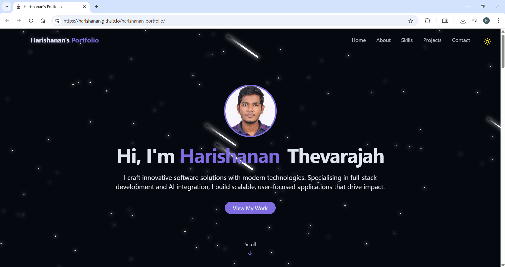

# Harishanan's Portfolio

A **modern, performant, and scalable personal portfolio** built with React, JavaScript, TailwindCSS, and Vite — designed to showcase professional skills, projects, and experience with an emphasis on clean architecture, responsive design, and best development practices.

<p align="center">
  
</p>

---

## Table of Contents

- [Project Overview](#project-overview)  
- [Technical Architecture](#technical-architecture)  
- [Key Features](#key-features)  
- [Development Setup](#development-setup)  
- [Build & Deployment](#build--deployment)  
- [Tech References](#tech-references)  
- [Project Highlights](#project-highlights)
- [Accessibility Note](#accessibility-note)

---

## Project Overview

This portfolio is implemented as a **Single Page Application (SPA)** leveraging React’s component-based architecture. It delivers an intuitive UI/UX optimized for desktop and mobile devices, with state-of-the-art frontend technologies and tooling.

The goal: present my professional profile with **fast load times, accessibility, and maintainable code**—all crucial for a strong developer portfolio.

---

## Technical Architecture

- **React (v19) with JavaScript**  
  Strong typing enhances maintainability, scalability, and developer productivity. Functional components with hooks drive UI logic and state management.

- **TailwindCSS**  
  Utility-first CSS framework for modular, responsive styling with minimal CSS file sizes. Dark mode support implemented with Tailwind’s theming.

- **Vite**  
  Modern, lightning-fast development server and build tool leveraging ES modules, resulting in near-instant hot module replacement (HMR) and optimized production builds.

- **Lucide Icons & Radix UI Primitives**  
  Lightweight, accessible UI primitives and iconography for consistent visual language and ARIA-compliant interactive components.

- **Form Handling & Notifications**  
  Efficient form state management and validation with React Hook Form. Toast notifications provide user feedback for contact form submissions.

- **EmailJS Integration**  
  Secure, client-side email sending for contact form without backend dependency.

- **Routing**  
  `react-router-dom` enables scalable and maintainable page structure. Smooth in-page navigation is handled via native anchor links and CSS scroll behavior.

---

## Key Features

- **Dark/Light Mode with Persistent Theme Preference** — Local storage backed with seamless UI transitions.  
- **Animated Interactive Backgrounds** — Optimised CSS and React-based animations for engaging UI without compromising performance.  
- **Responsive Design & Accessibility** — Mobile-first approach with ARIA roles and keyboard navigation support.  
- **Project Showcase** — Dynamically rendered project cards with tech stack tags and GitHub/demo links.  
- **Contact Form with Real-Time Validation & Notifications** — Enhances user engagement and lead capture.  
- **One-Click Deployment via GitHub Pages** — Fully automated deployment using `gh-pages` package and Vite build outputs.  


---

## Development Setup

```
git clone https://github.com/harishanan/harishanan-portfolio.git
cd harishanan-portfolio
npm install
npm run dev
```

- Runs the app locally with Vite on [http://localhost:5173](http://localhost:5173).
- Hot module replacement ensures immediate reflection of code changes.
- Linting and formatting via ESLint and Prettier (configurable).

---

## Build & Deployment

### Production Build

```
npm run build
```

- Generates highly optimized static assets in the `/dist` directory.  
- Assets are minified, code-split, and cache-busted for maximum performance.

### GitHub Pages Deployment

- Uses `gh-pages` npm package for deploying the `/dist` directory to the `gh-pages` branch.  
- Configure `vite.config.ts` with appropriate `base` path matching the GitHub Pages repo URL.  
- Deployment script example in `package.json`:

```json
"scripts": {
  "predeploy": "npm run build",
  "deploy": "gh-pages -d dist"
}
```

- Run **npm run deploy** to publish updates seamlessly.

---

## 🛠️Tech References

- [React](https://reactjs.org/) – Component-based UI library  
- [Vite](https://vitejs.dev/) – Fast build tool and development server  
- [Tailwind CSS](https://tailwindcss.com/) – Utility-first CSS framework  
- [Lucide Icons](https://lucide.dev/) – Open-source icon set  
- [Radix UI](https://www.radix-ui.com/) – Accessible UI primitives  
- [React Router](https://reactrouter.com/) – Declarative routing for React  
- [gh-pages](https://www.npmjs.com/package/gh-pages) – GitHub Pages deployment tool  
- [EmailJS](https://www.emailjs.com/) – Email service integration in frontend  
- [ESLint](https://eslint.org/) – JavaScript linting utility  
- [Prettier](https://prettier.io/) – Code formatter  
- [GitHub Pages](https://pages.github.com/) – Static site hosting 


---


## ✅Project Highlights

### Fast Load Times
- **Vite:** Your app uses Vite, a modern frontend build tool known for fast dev server startup and optimized production builds.  
- **Code-splitting & Caching:** Vite’s production build includes tree-shaking, minification, and cache-busting file names.  
- **GitHub Pages:** Hosting on GitHub Pages provides good CDN-level performance for static sites.

### Accessibility
- **Radix UI Primitives:** These are designed with accessibility in mind—ensuring ARIA roles, keyboard navigation, and screen reader compatibility.  
- **Responsive Design:** Your TailwindCSS-based layout adjusts well across devices.  
- **Clear Structure & Contrast:** The use of dark/light mode, semantic sections (Hero, Projects, Contact), and visible interactive elements all help with accessibility.  


### Maintainable Code
- **Component-Based Architecture (React):** Easy to reuse and update sections like Hero, Projects, etc.  
- **Tailwind CSS:** Keeps styling atomic and inside components, avoiding messy CSS files.  
- **ESLint & Prettier:** Included for code quality and consistent formatting.  
- **Modular File Structure:** Logical file grouping helps onboard others or future-you.

---

## ♿Accessibility Note

**ARIA-compliant** refers to following the **Accessible Rich Internet Applications (ARIA)** standards, as defined by the [WAI-ARIA specification](https://www.w3.org/TR/wai-aria/).

In simple terms, ARIA-compliant interactive components are:

- **Accessible to screen readers** — allowing visually impaired users to understand and navigate the interface.
- **Keyboard-navigable** — ensuring functionality without relying on a mouse.
- **Informative to assistive technologies** — exposing roles, states, and labels for better usability.

Using tools like **Radix UI** ensures that components are built with accessibility best practices in mind, reducing barriers and improving UX for all users.
